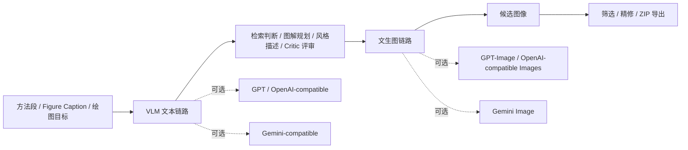

<p align="center">
  
</p>

<h1 align="center">PaperBanana-CN · 纸香蕉</h1>

<p align="center">
  <strong>没有官方 API、只会一点 GitHub，也能用中转站跑起来的中文科研绘图工作台。</strong><br>
  复制项目，填入第三方 Base URL 和 API Key，就能在浏览器里生成、筛选、精修论文图。
</p>

<p align="center">
  <a href="https://github.com/917940234/PaperBanana-CN/stargazers"></a>
  <a href="https://github.com/917940234/PaperBanana-CN/network/members"></a>
  <a href="https://github.com/917940234/PaperBanana-CN/actions"></a>
  <a href="https://github.com/917940234/PaperBanana-CN/blob/main/LICENSE"></a>
</p>

<p align="center">
  
  
  
  
  
  
</p>

<p align="center">
  <a href="https://huggingface.co/papers/2601.23265"></a>
  <a href="https://huggingface.co/datasets/dwzhu/PaperBananaBench"></a>
  <a href="https://github.com/dwzhu-pku/PaperBanana"></a>
</p>

---

## 一句话

PaperBanana-CN 是给中文科研用户用的论文图生成工具。它把“理解论文的 VLM 文本模型”和“真正出图的文生图模型”拆开配置，所以你没有 OpenAI / Gemini 官方 API，也可以用第三方中转站、自建 gateway 或不同平台的 Key 跑起来。

你只需要会三件事：从 GitHub 下载项目、在终端复制命令、在网页里填 API Key 和 Base URL。

## 它解决什么痛点

| 新手真实痛点 | PaperBanana-CN 怎么帮你 |
| --- | --- |
| 官方 API 申请麻烦、贵、或者访问不稳定 | 支持 OpenAI-compatible 和 Gemini-compatible 中转站，只要平台给你 Base URL 和 API Key。 |
| 文本模型和生图模型不是同一个平台 | GUI 里有两块：**VLM 文本** 和 **文生图**，各填各的 Key、URL、模型名。 |
| 不想学一堆 YAML 配置 | 首次使用直接在网页左侧填，不需要手写配置文件。 |
| 怕一上来花很多钱 | 首次试跑可以用 `候选数=1`、`检索=none`、`最大评审轮次=0`。 |
| 不知道论文图该怎么改 | 生成多个候选后，可以收藏、淘汰、选最终图，再送去精修。 |
| 想做实验结果图，不只是文生图 | `plot` 任务会偏向生成 Matplotlib 代码并本地渲染。 |

## 三步启动

适合只懂一点 GitHub 的用户：

```bash
git clone https://github.com/917940234/PaperBanana-CN.git
cd PaperBanana-CN
uv sync --locked
uv run paperbanana
```

浏览器打开：

```text
http://localhost:8501
```

如果没有安装 `uv`，先装一次：

```bash
curl -LsSf https://astral.sh/uv/install.sh | sh
```

Windows 用户可以在 PowerShell 安装 `uv` 后进入项目目录运行同样命令。如果 `uv run paperbanana` 异常，用备用方式：

```bash
uv run python -m streamlit run demo.py
```

## 第一次怎么填

打开 GUI 后，不要被所有高级选项吓到。第一次只看左侧这两块：

<p align="center">
  
</p>

| GUI 区域 | 它负责什么 | 新手该填什么 |
| --- | --- | --- |
| **VLM 文本** | 理解论文、规划图、评审候选图 | 文本模型的 API Key、Base URL、模型名 |
| **文生图** | 真正生成图像，或对已有图继续精修 | 生图模型的 API Key、Base URL、模型名 |

最简单的首次试跑：

1. 生成任务选 `学术图解`。
2. 候选方案数量设为 `1`。
3. 参考样例策略选 `none` 或 `智能检索（轻量）`。
4. 最大评审轮次设为 `0` 或 `1`。
5. VLM 文本和文生图都先填你同一个中转站提供的 URL、Key 和模型名。
6. 能跑通后，再增加候选数、检索和评审轮次。

常见填写方式：

```text
VLM 文本:
  Provider: GPT
  Base URL: https://你的中转站/v1
  API Key: 你的文本模型 key
  模型名: gpt-5.5 或平台给你的模型名

文生图:
  Provider: GPT
  Base URL: https://你的中转站/v1
  API Key: 你的生图模型 key
  模型名: gpt-image-2 或平台给你的模型名
```

也可以混用：

```text
VLM 文本: GPT + 中转站 A
文生图: Gemini + 中转站 B
```

这就是本项目对国内用户最友好的地方：两条链路不用绑死在同一个官方平台。

## 界面长什么样

<table>
  <tr>
    <td width="50%"></td>
    <td width="50%"></td>
  </tr>
  <tr>
    <td align="center"><strong>生成工作台</strong><br>右侧粘贴方法段和图注，左侧控制候选数、检索、宽高比、模型链路。</td>
    <td align="center"><strong>启动前检查</strong><br>真正调用模型前先检查 Key、模型名、检索策略和输出目录。</td>
  </tr>
  <tr>
    <td width="50%"></td>
    <td width="50%"></td>
  </tr>
  <tr>
    <td align="center"><strong>精修图像</strong><br>选中候选图或上传图片后继续改图，仍然支持中转站和分离模型。</td>
    <td align="center"><strong>候选决策</strong><br>收藏、淘汰、设为最终候选，并把结果打包导出。</td>
  </tr>
</table>

## 你可以用它做什么

| 任务 | 适合场景 |
| --- | --- |
| 学术图解 | 方法框架图、流程图、机制图、系统图、graphical abstract 草图。 |
| 统计图表 | 把 CSV、实验数据或绘图意图转成 Matplotlib 图。 |
| 多候选生成 | 一次生成多个版本，横向比较后选最终图。 |
| 图像精修 | 对已有候选图继续改图、放大、统一风格。 |
| 历史回放 | 查看每次运行的阶段输出、评审建议和最终结果。 |
| ZIP 导出 | 打包候选图、JSON、阶段描述、绘图代码和全流程记录。 |

## 模型链路



推荐组合：

| 场景 | VLM 文本 | 文生图 |
| --- | --- | --- |
| 一个中转站同时提供文本和生图 | GPT / OpenAI-compatible | GPT / OpenAI-compatible |
| 文本想用 GPT，出图想用 Gemini | GPT / OpenAI-compatible | Gemini-compatible |
| 只有 Gemini 网关 | Gemini-compatible | Gemini-compatible |
| 先省钱试跑 | 任意可用文本模型 | 候选数设低，检索和评审先关小 |

## 环境变量配置

GUI 足够新手使用。长期使用时，也可以把配置写进环境变量：

```bash
# GPT / OpenAI-compatible 文本链路
export PAPERBANANA_OPENAI_BASE_URL="https://your-openai-compatible-gateway/v1"
export PAPERBANANA_OPENAI_VLM_API_KEY="sk-..."
export PAPERBANANA_OPENAI_VLM_MODEL="gpt-5.5"

# GPT / OpenAI-compatible 图像链路
export PAPERBANANA_OPENAI_IMAGE_API_KEY="sk-..."
export PAPERBANANA_OPENAI_IMAGE_MODEL="gpt-image-2"
export PAPERBANANA_OPENAI_IMAGE_TIMEOUT_SEC=360
export PAPERBANANA_OPENAI_IMAGE_MAX_ATTEMPTS=3
```

```bash
# Gemini-compatible 文本与图像链路
export PAPERBANANA_GEMINI_BASE_URL="https://your-gemini-compatible-gateway"
export PAPERBANANA_GEMINI_VLM_API_KEY="your-key"
export PAPERBANANA_GEMINI_IMAGE_API_KEY="your-image-key"
export PAPERBANANA_GEMINI_VLM_MODEL="gemini-3.1-flash-lite-preview"
export PAPERBANANA_GEMINI_IMAGE_MODEL="gemini-3.1-flash-image-preview"
```

也可以把密钥放到本地文件，避免写进 Git：

```text
configs/local/openai_vlm_api_key.txt
configs/local/openai_image_api_key.txt
configs/local/gemini_vlm_api_key.txt
configs/local/gemini_image_api_key.txt
```

这些路径已被 `.gitignore` 忽略。

## 参数怎么传

| Provider | 宽高比/分辨率如何传参 | 示例 |
| --- | --- | --- |
| GPT / OpenAI-compatible | 自动换算为 OpenAI Images `size` | `16:9 + 4K -> 3840x2160`，`9:16 + 4K -> 2160x3840` |
| Gemini-compatible | 写入 Gemini `image_config.aspect_ratio` 与 `image_config.image_size` | `16:9 + 4K -> aspect_ratio=16:9, image_size=4K` |
| Plot 任务 | 不调用文生图模型，生成 Matplotlib 代码后本地渲染 | 适合统计图、折线图、柱状图、消融图 |

当文生图选择 GPT / OpenAI-compatible 时，GUI 会显示 OpenAI 图像参数，例如 `quality`、`background`、`output_format`、`size`、`input_fidelity`。新手可以先保持默认，能跑通后再调。

## CLI 用法

多数用户先用 GUI。需要批处理时再用 CLI：

```bash
uv run paperbanana run \
  --task_name diagram \
  --exp_mode demo_planner_critic \
  --provider gemini \
  --retrieval_setting none
```

查看流程演化：

```bash
uv run paperbanana viewer evolution
```

查看参考评测：

```bash
uv run paperbanana viewer eval
```

查看全部命令：

```bash
uv run paperbanana --help
```

## 数据集

基础 GUI 可以不下载数据集直接试用。若需要参考样例检索、few-shot 质量提升或复现实验，推荐下载 PaperBananaBench：

```text
data/PaperBananaBench/
├── diagram/
│   ├── ref.json
│   ├── test.json
│   └── images/
└── plot/
    ├── ref.json
    ├── test.json
    └── images/
```

数据集地址：[`dwzhu/PaperBananaBench`](https://huggingface.co/datasets/dwzhu/PaperBananaBench)

## 项目结构

```text
PaperBanana-CN/
├── agents/                # Retriever / Planner / Stylist / Visualizer / Critic / Polish
├── configs/               # 模型配置、Provider 注册、本地密钥目录
├── prompts/               # 图解与图表任务提示词
├── providers/             # Provider 接入层
├── utils/                 # 配置、运行时、导出、图像处理、checkpoint
├── visualize/             # 历史回放与参考评测 viewer
├── assets/readme/         # README 截图
├── demo.py                # Streamlit GUI
├── main.py                # 批处理入口
├── cli.py                 # paperbanana / paperbanana-cn 命令入口
└── pyproject.toml         # Python 包元数据
```

## Star History

如果这个项目帮你省下了调图和接 API 的时间，欢迎点一个 Star。开源项目传播主要靠早期使用者把真实体验传出去。

<picture>
  <source media="(prefers-color-scheme: dark)" srcset="https://api.star-history.com/svg?repos=917940234/PaperBanana-CN&type=Date&theme=dark" />
  <source media="(prefers-color-scheme: light)" srcset="https://api.star-history.com/svg?repos=917940234/PaperBanana-CN&type=Date" />
  
</picture>

<p align="center">
  <a href="https://github.com/917940234/PaperBanana-CN">
    
  </a>
</p>

## Roadmap

- 更完整的中文示例库与 prompt 模板。
- 更多国内中转站的预设说明。
- 更稳的批量任务恢复与失败重试报告。
- 适合论文投稿的图像导出命名规范。
- 面向真实工业图片和截图素材的多图组合工作流。

## 与原项目的关系

PaperBanana-CN 建立在 PaperBanana 生态之上，主要做中文化体验、模型网关适配和工程化增强。

- 原始项目：[`dwzhu-pku/PaperBanana`](https://github.com/dwzhu-pku/PaperBanana)
- 原始论文：[*PaperBanana: Automating Academic Illustration for AI Scientists*](https://huggingface.co/papers/2601.23265)
- 数据集：[`dwzhu/PaperBananaBench`](https://huggingface.co/datasets/dwzhu/PaperBananaBench)

如果你的工作使用了 PaperBanana 方法或 PaperBananaBench，请优先引用原始论文与数据集。本仓库主要提供中文友好界面、模型网关适配、VLM/文生图分离配置、后台任务、导出回放和精修工作流。

## License

本仓库代码以 Apache-2.0 许可证发布。请在商业用途前自行核查原项目说明、论文页面、许可证和相关专利/使用限制。
