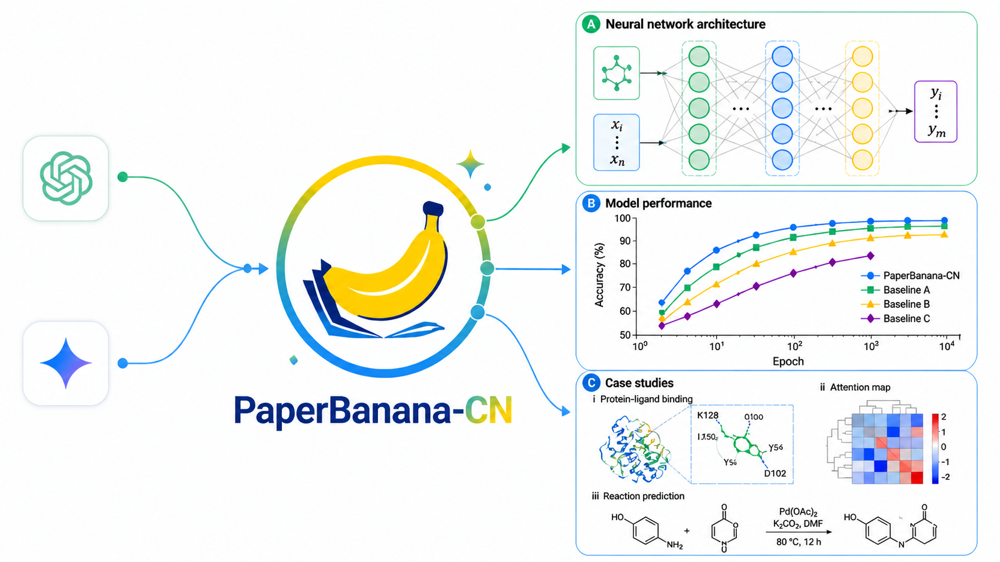
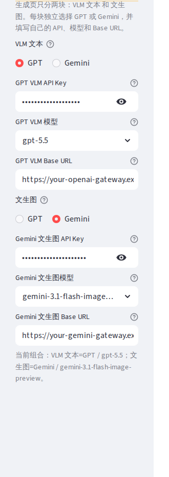
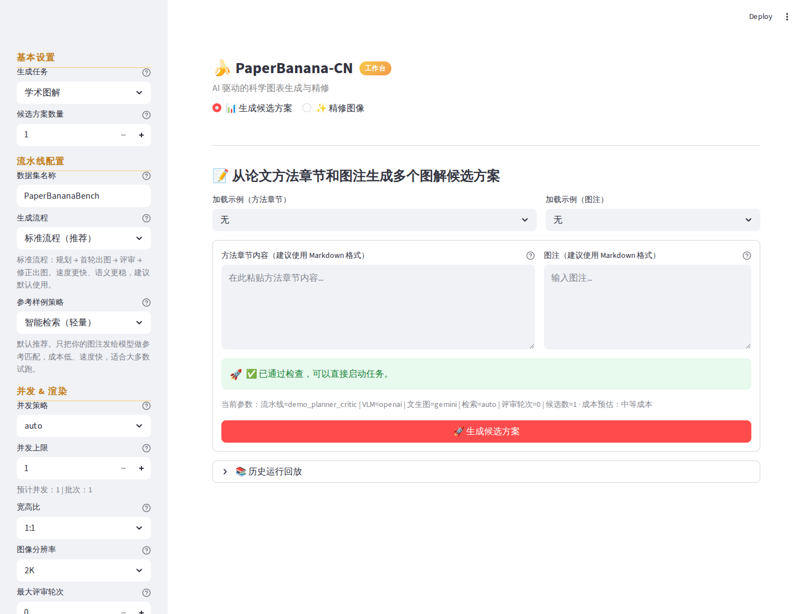
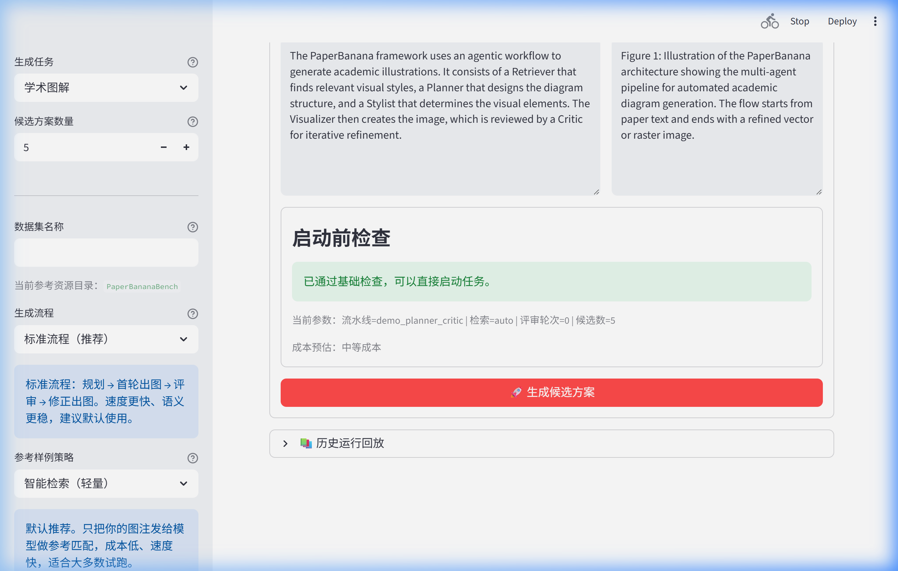
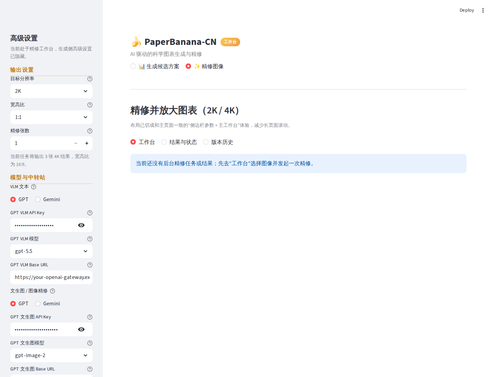
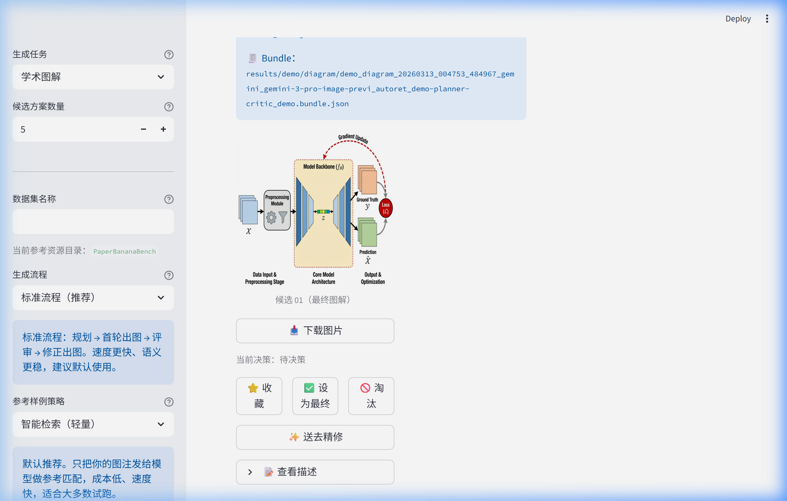
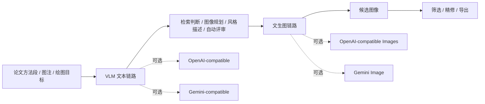

<p align="center">
  
</p>

<h1 align="center">PaperBanana-CN · 纸香蕉</h1>

<p align="center">
  <strong>面向中文科研场景的 PaperBanana 增强版：支持第三方兼容服务、自建网关，以及 VLM 与图像模型分离配置。</strong><br>
  适合需要生成论文图、方法示意图、实验图表和候选图精修的研究者。
</p>

<p align="center">
  <a href="https://github.com/917940234/PaperBanana-CN/stargazers"></a>
  <a href="https://github.com/917940234/PaperBanana-CN/blob/main/LICENSE"></a>
  
  
  
  
</p>

<p align="center">
  <a href="#项目概览">项目概览</a> ·
  <a href="#获取项目">获取项目</a> ·
  <a href="#启动流程">启动流程</a> ·
  <a href="#模型与中转站配置">模型配置</a> ·
  <a href="#界面预览">界面预览</a> ·
  <a href="#项目来源与致谢">项目来源</a>
</p>

---

## 项目概览

PaperBanana-CN 是一个中文友好的科研绘图工作台。它保留 PaperBanana 面向学术插图自动化的核心思想，并在实际使用层面补充了更适合国内用户的模型接入方式、图形界面、任务回放、候选图管理和导出能力。

本项目尤其关注一个常见使用场景：用户没有官方 OpenAI 或 Gemini API，但可以使用第三方兼容服务、自建网关或学校/团队提供的统一接口。PaperBanana-CN 允许分别配置用于理解论文内容的 VLM 文本模型，以及用于生成或精修图像的图像模型，因此不要求所有能力来自同一个平台。

> [!NOTE]
> 这里的“中转站”指提供 OpenAI-compatible 或 Gemini-compatible API 的第三方兼容服务。具体模型名、Base URL 格式、额度和稳定性由服务方决定，建议先用低候选数完成连通性验证。

## 核心价值

| 使用需求 | PaperBanana-CN 的支持方式 |
| --- | --- |
| 没有官方 API | 可通过第三方兼容服务或自建网关填写 Base URL 与 API Key。 |
| 文本模型和图像模型来自不同平台 | VLM 文本链路与文生图链路独立配置，可分别填写模型名、Key 和 URL。 |
| 需要尽快在本地打开图形界面 | 使用 `uv sync --locked` 安装依赖，`uv run paperbanana` 启动 Streamlit GUI。 |
| 担心首次试运行成本 | 可将候选数设为 `1`、检索设为 `none`、评审轮次设为 `0`。 |
| 需要比较多个候选图 | 支持候选图预览、收藏、淘汰、设为最终候选，并导出完整结果。 |
| 需要继续修改已有图像 | 支持上传或选择候选图后继续精修。 |
| 需要实验图表而非纯图像生成 | `plot` 任务侧重生成 Matplotlib 代码并在本地渲染。 |

## 获取项目

如果只熟悉 GitHub 的基础操作，可以使用下载压缩包的方式。

1. 打开仓库页面：<https://github.com/917940234/PaperBanana-CN>
2. 点击绿色 `Code` 按钮。
3. 选择 `Download ZIP`。
4. 解压后进入项目目录，目录名通常类似 `PaperBanana-CN-main`。

解压后的目录名可能与后续示例不同。只要终端当前目录位于包含 `README.md`、`pyproject.toml`、`demo.py` 的项目根目录，即可继续执行启动命令。

如果已经安装 Git，推荐使用克隆方式，后续更新更方便：

```bash
git clone https://github.com/917940234/PaperBanana-CN.git
cd PaperBanana-CN
```

> [!TIP]
> Windows 用户可以在资源管理器中进入解压后的目录，在地址栏输入 `powershell` 后回车，即可在当前目录打开 PowerShell。
> 若使用 GitHub 下载 ZIP，目录通常为 `PaperBanana-CN-main`；若使用 `git clone`，目录通常为 `PaperBanana-CN`。

## 启动流程

项目推荐使用 `uv` 管理 Python 依赖。运行环境建议为 Python 3.12 或更高版本。

<details>
<summary>安装 uv</summary>

Linux / macOS:

```bash
curl -LsSf https://astral.sh/uv/install.sh | sh
```

Windows PowerShell:

```powershell
powershell -ExecutionPolicy ByPass -c "irm https://astral.sh/uv/install.ps1 | iex"
```

</details>

安装依赖并启动 GUI：

```bash
uv sync --locked
uv run paperbanana
```

启动后浏览器访问：

```text
http://localhost:8501
```

备用启动方式：

```bash
uv run python -m streamlit run demo.py
```

> [!TIP]
> 如果 Python 包下载较慢，可以临时指定常用镜像源后再同步依赖：
>
> ```bash
> UV_INDEX_URL=https://pypi.tuna.tsinghua.edu.cn/simple uv sync --locked
> ```

## 模型与中转站配置

首次使用时，优先在 GUI 左侧完成模型配置。PaperBanana-CN 将模型链路拆成两类：

<p align="center">
  
</p>

| 配置区域 | 作用 | 需要填写 |
| --- | --- | --- |
| VLM 文本链路 | 理解论文内容、规划图像、生成评审建议 | 文本模型的 Provider、Base URL、API Key、模型名 |
| 文生图链路 | 生成候选图、精修已有图像 | 图像模型的 Provider、Base URL、API Key、模型名 |

常见配置形态：

| 场景 | VLM 文本链路 | 文生图链路 |
| --- | --- | --- |
| 同一服务同时提供文本和图像模型 | 填同一服务的文本模型信息 | 填同一服务的图像模型信息 |
| 文本使用 OpenAI-compatible，图像使用 Gemini-compatible | Provider 选择 GPT / OpenAI-compatible | Provider 选择 Gemini-compatible |
| 只有一个 Gemini 兼容网关 | 两侧都使用该网关提供的 Gemini 模型 | 两侧都使用该网关提供的图像模型 |
| 只做低成本连通性验证 | 使用可用的低成本文本模型 | 候选数设低，检索和评审先关闭或调低 |

示例配置：

```text
VLM 文本链路
Provider: GPT
Base URL: https://your-gateway.example.com/v1
API Key: sk-...
模型名: gpt-5.5 或服务方提供的文本模型名

文生图链路
Provider: GPT
Base URL: https://your-gateway.example.com/v1
API Key: sk-...
模型名: gpt-image-2 或服务方提供的图像模型名
```

> [!IMPORTANT]
> 不同兼容服务对 Base URL 的要求可能不同。OpenAI-compatible 接口通常包含 `/v1`，Gemini-compatible 接口是否包含版本路径应以服务方文档为准。

## 初始运行建议

为了确认环境和模型链路可用，建议先使用较小配置运行一次：

| 设置项 | 建议值 | 说明 |
| --- | --- | --- |
| 任务类型 | `diagram` | 先验证学术图解生成链路。 |
| 候选方案数量 | `1` | 降低首次调用成本。 |
| 参考样例策略 | `none` | 未下载数据集时也可运行。 |
| 最大评审轮次 | `0` 或 `1` | 先验证生成，再逐步增加自动评审。 |
| 图像比例 | `16:9` 或 `4:3` | 通用横向论文图优先选择。 |

输入内容建议分为两部分：

| 输入框 | 内容建议 |
| --- | --- |
| Method Content | 粘贴方法段、系统流程、模块关系、变量含义或实验目标。 |
| Figure Caption | 粘贴准备写入论文的图注，说明图要表达什么，而不是让模型把图注文字画进图片。 |

## 界面预览

<table>
  <tr>
    <td width="50%"></td>
    <td width="50%"></td>
  </tr>
  <tr>
    <td align="center"><strong>生成工作台</strong><br>配置任务、检索、候选数量、宽高比和模型链路。</td>
    <td align="center"><strong>启动前检查</strong><br>在正式调用模型前检查 Key、模型名、检索策略和输出目录。</td>
  </tr>
  <tr>
    <td width="50%"></td>
    <td width="50%"></td>
  </tr>
  <tr>
    <td align="center"><strong>图像精修</strong><br>对候选图或上传图继续修改，保持同一套模型接入方式。</td>
    <td align="center"><strong>候选决策</strong><br>收藏、淘汰、设为最终候选，并导出完整运行结果。</td>
  </tr>
</table>

## 工作流



## 环境变量配置

GUI 配置适合交互式使用。长期使用或多次启动时，可以将模型信息写入环境变量。

```bash
# OpenAI-compatible 文本链路
export PAPERBANANA_OPENAI_BASE_URL="https://your-openai-compatible-gateway/v1"
export PAPERBANANA_OPENAI_VLM_API_KEY="sk-..."
export PAPERBANANA_OPENAI_VLM_MODEL="gpt-5.5"

# OpenAI-compatible 图像链路
export PAPERBANANA_OPENAI_IMAGE_API_KEY="sk-..."
export PAPERBANANA_OPENAI_IMAGE_MODEL="gpt-image-2"
export PAPERBANANA_OPENAI_IMAGE_TIMEOUT_SEC=360
export PAPERBANANA_OPENAI_IMAGE_MAX_ATTEMPTS=3
```

```bash
# Gemini-compatible 文本与图像链路
export PAPERBANANA_GEMINI_BASE_URL="https://your-gemini-compatible-gateway"
export PAPERBANANA_GEMINI_VLM_API_KEY="your-key"
export PAPERBANANA_GEMINI_IMAGE_API_KEY="your-image-key"
export PAPERBANANA_GEMINI_VLM_MODEL="gemini-3.1-flash-lite-preview"
export PAPERBANANA_GEMINI_IMAGE_MODEL="gemini-3.1-flash-image-preview"
```

也可以把密钥放入本地文件，避免写入 Git：

```text
configs/local/openai_vlm_api_key.txt
configs/local/openai_image_api_key.txt
configs/local/gemini_vlm_api_key.txt
configs/local/gemini_image_api_key.txt
```

这些路径已被 `.gitignore` 忽略。

## 功能范围

| 功能 | 说明 |
| --- | --- |
| 学术图解 | 方法框架图、流程图、系统图、机制图、graphical abstract 草图。 |
| 统计图表 | 将数据、绘图意图或实验结果描述转为 Matplotlib 图。 |
| 多候选生成 | 同一任务生成多个候选版本，便于横向比较。 |
| 自动评审 | 使用 Critic 回合给出候选图修改建议。 |
| 图像精修 | 对已有候选图或上传图片继续修改。 |
| 任务回放 | 查看每次运行的阶段输出、模型响应和候选结果。 |
| ZIP 导出 | 打包候选图、JSON、阶段描述、绘图代码和运行记录。 |

## 参数与模型行为

| Provider | 宽高比与分辨率处理 | 适用说明 |
| --- | --- | --- |
| GPT / OpenAI-compatible | 转换为 OpenAI Images `size` 参数 | 适合兼容 OpenAI 图像接口的服务。 |
| Gemini-compatible | 写入 Gemini `image_config.aspect_ratio` 与 `image_config.image_size` | 适合兼容 Gemini 图像接口的服务。 |
| Plot 任务 | 生成 Matplotlib 代码并本地渲染 | 适合折线图、柱状图、消融图等实验图表。 |

当文生图链路选择 GPT / OpenAI-compatible 时，GUI 会提供 `quality`、`background`、`output_format`、`size`、`input_fidelity` 等图像参数。初始运行可以保持默认值，确认链路可用后再细调。

## 数据集

基础 GUI 可以不下载数据集直接试用。若需要参考样例检索、few-shot 质量提升或复现实验，可下载 PaperBananaBench：

```text
data/PaperBananaBench/
├── diagram/
│   ├── ref.json
│   ├── test.json
│   └── images/
└── plot/
    ├── ref.json
    ├── test.json
    └── images/
```

数据集地址：[`dwzhu/PaperBananaBench`](https://huggingface.co/datasets/dwzhu/PaperBananaBench)

> [!WARNING]
> 若暂时无法访问 Hugging Face 数据集，仍可将检索策略设为 `none` 进行基础生成。需要复现实验或使用参考样例时，再补齐上述目录结构。

## 命令行用法

多数交互式任务建议先使用 GUI。需要批处理、复现实验或脚本化运行时，可使用 CLI。

```bash
uv run paperbanana run \
  --task_name diagram \
  --exp_mode demo_planner_critic \
  --provider gemini \
  --retrieval_setting none
```

查看流程演化：

```bash
uv run paperbanana viewer evolution
```

查看参考评测：

```bash
uv run paperbanana viewer eval
```

查看全部命令：

```bash
uv run paperbanana --help
```

## 项目结构

```text
PaperBanana-CN/
├── agents/                # Retriever / Planner / Stylist / Visualizer / Critic / Polish
├── configs/               # 模型配置、Provider 注册、本地密钥目录
├── prompts/               # 图解与图表任务提示词
├── providers/             # Provider 接入层
├── utils/                 # 配置、运行时、导出、图像处理、checkpoint
├── visualize/             # 历史回放与参考评测 viewer
├── assets/readme/         # README 截图
├── demo.py                # Streamlit GUI
├── main.py                # 批处理入口
├── cli.py                 # paperbanana / paperbanana-cn 命令入口
└── pyproject.toml         # Python 包元数据
```

## 开源传播

如果本项目对你的论文绘图、模型接入或本地工作流有帮助，欢迎 Star、Fork 或在 issue 中反馈具体服务商兼容情况。真实使用反馈可以帮助后续完善中文示例和网关配置说明。

<picture>
  <source media="(prefers-color-scheme: dark)" srcset="https://api.star-history.com/svg?repos=917940234/PaperBanana-CN&type=Date&theme=dark" />
  <source media="(prefers-color-scheme: light)" srcset="https://api.star-history.com/svg?repos=917940234/PaperBanana-CN&type=Date" />
  
</picture>

## Roadmap

- 补充更完整的中文示例库与任务模板。
- 增加常见第三方兼容服务的配置示例。
- 改进批量任务恢复、失败重试和错误报告。
- 完善面向论文投稿的图像导出命名规范。
- 探索面向真实照片、软件截图和工业场景素材的多图组合工作流。

## 项目来源与致谢

PaperBanana-CN 建立在 PaperBanana 生态之上。本仓库尊重并感谢原始作者对学术插图自动化方法、数据集和代码基础的贡献。

- 原始项目：[`dwzhu-pku/PaperBanana`](https://github.com/dwzhu-pku/PaperBanana)
- 原始论文：[*PaperBanana: Automating Academic Illustration for AI Scientists*](https://huggingface.co/papers/2601.23265)
- 数据集：[`dwzhu/PaperBananaBench`](https://huggingface.co/datasets/dwzhu/PaperBananaBench)
- PaperBananaPro：[`elpsykongloo/PaperBanana-Pro`](https://github.com/elpsykongloo/PaperBanana-Pro)

PaperBananaPro 是在原始 PaperBanana 基础上的增强版本之一，提供了更偏工程化和使用体验的扩展。本仓库在相关基础上继续面向中文科研用户补充中文界面说明、第三方兼容服务接入、VLM/图像模型分离配置、候选图管理、任务回放和导出流程。

如果你的工作使用了 PaperBanana 方法或 PaperBananaBench，请优先引用原始论文与数据集；如果使用了本仓库的中文化和模型网关能力，也欢迎在项目说明中注明 PaperBanana-CN。

## License

本仓库代码以 Apache-2.0 许可证发布。商业用途、第三方服务调用、模型输出版权和数据集使用限制，请以原项目说明、论文页面、许可证以及所用模型/服务商条款为准。
