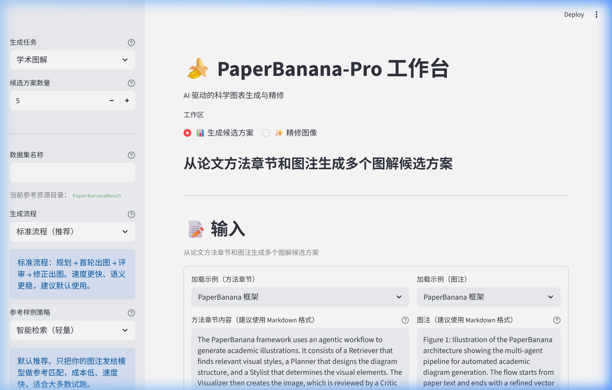
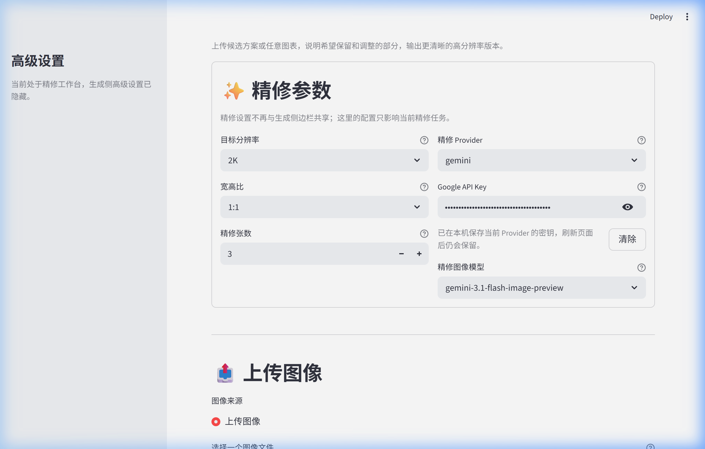

# PaperBanana-Pro

> 多 Agent 驱动的科研插图与统计图生成系统，提供中文 GUI、CLI 批处理与结果审阅工具。

[](https://huggingface.co/datasets/dwzhu/PaperBananaBench)
[](https://huggingface.co/papers/2601.23265)


## ✨ 功能展示

### 生成候选方案



输入论文的方法章节和图注，一键生成多个科研插图候选方案。左侧边栏可选择生成任务（学术图解 / 统计图）、流水线流程和参考样例策略。

### 启动前检查与参数预览


点击生成前，系统会自动校验参数配置并预估成本，确认无误后一键启动。

### 候选结果与决策


生成完成后，每个候选方案都会展示最终图解、下载入口和决策按钮（收藏 / 设为最终 / 淘汰），支持一键送入精修页继续打磨。

### 图像精修（2K / 4K）



独立的精修工作台，支持设置目标分辨率、宽高比和并发精修张数。每轮精修会形成版本链，可从任意历史版本继续或回退。

## 🚀 快速开始

### 1. 安装

```bash
git clone https://github.com/elpsykongloo/PaperBanana-Pro.git
cd PaperBanana-Pro
uv python install 3.12
uv sync --locked
uv tool install --editable . --force
```

安装完成后，`paperbanana` 命令可在任意目录使用。如未进入 PATH，执行 `uv tool update-shell` 即可。

> [!TIP]
> 不需要全局命令？也可以直接 `streamlit run demo.py` 启动 GUI，或 `python main.py --help` 使用 CLI。

### 2. 准备数据集（可选）

下载 [`dwzhu/PaperBananaBench`](https://huggingface.co/datasets/dwzhu/PaperBananaBench) 并放到 `data/PaperBananaBench/` 下。该数据集提供 few-shot 参考样例和评估基准。

如果只是试用，可将检索设置为 `none` 跳过数据集依赖。

### 3. 配置 API Key

```bash
Copy-Item configs\model_config.template.yaml configs\model_config.yaml
```

在 `configs/model_config.yaml` 中填入你的 API Key，或将 Key 写入以下文件（任选一种方式）：

- `configs/local/google_api_key.txt`
- `configs/local/evolink_api_key.txt`

当前正式支持两个 Provider：**Gemini**（推荐日常使用）和 **Evolink**。

### 4. 启动

```bash
paperbanana
```

## 📖 使用指南

### GUI — 主产品界面

```bash
paperbanana gui
```

提供两个核心工作区：

- **生成候选方案**：`diagram`（科研插图）或 `plot`（统计图），支持后台生成、多候选并发、实时预览、历史回放、批量导出
- **精修图像**：对候选结果做修改、放大，支持版本历史、并发精修、批量下载

### CLI — 批处理

```bash
paperbanana run --task_name diagram --exp_mode demo_full --provider gemini
```

适合数据集批量运行与产物归档。常用参数：

| 参数 | 说明 |
| --- | --- |
| `--task_name` | `diagram` 或 `plot` |
| `--exp_mode` | 流水线模式，如 `demo_full`、`demo_planner_critic` |
| `--provider` | `gemini` / `evolink` |
| `--max_critic_rounds` | 最大评审轮数，可设为 `0` |
| `--retrieval_setting` | 检索模式：`auto`、`curated`、`none` 等 |
| `--resume` | 自动恢复上次运行 |

完整参数见 `paperbanana run --help`。

### Viewer — 结果审阅

```bash
paperbanana viewer evolution   # 查看流程演化
paperbanana viewer eval        # 查看带参考结果的评估
```

## 🏗️ 架构


| 阶段 | 作用 |
| --- | --- |
| Retriever | 从参考池中检索 few-shot 样例 |
| Planner | 生成结构化的可视化描述 |
| Stylist | 优化学术表达和风格一致性 |
| Visualizer | 生成图像（diagram）或 Matplotlib 代码（plot） |
| Critic | 多轮评审与修订建议 |
| Polish | 可选后处理精修 |

## 📁 项目结构

```text
PaperBanana-Pro/
├── agents/          # 多 Agent 阶段实现
├── configs/         # 模型与 API Key 配置
├── data/            # 数据集目录
├── visualize/       # Streamlit Viewer
├── cli.py           # 全局命令入口
├── demo.py          # GUI 主程序
├── main.py          # CLI 批处理入口
└── pyproject.toml   # 项目元数据与依赖
```

## 🗺️ 路线图

- [ ] 多语言 UI 与提示词支持
- [ ] 扩展更多会议数据集（ICML、ACL 等）
- [ ] Plot 结构化合同与自动修复（`PlotSpec`）
- [ ] 无参考自动质量评估（No-reference QA）
- [ ] 发布到 PyPI，支持 `uv tool install paperbanana-pro`

## 🙏 致谢

本项目在以下工作基础上独立演化：

- 原始仓库：[`dwzhu-pku/PaperBanana`](https://github.com/dwzhu-pku/PaperBanana)
- 中文参考：[`Mylszd/PaperBanana-CN`](https://github.com/Mylszd/PaperBanana-CN)
- 原始论文：[*PaperBanana: Automating Academic Illustration for AI Scientists*](https://huggingface.co/papers/2601.23265)

## 📄 License

Apache-2.0
